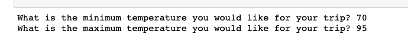
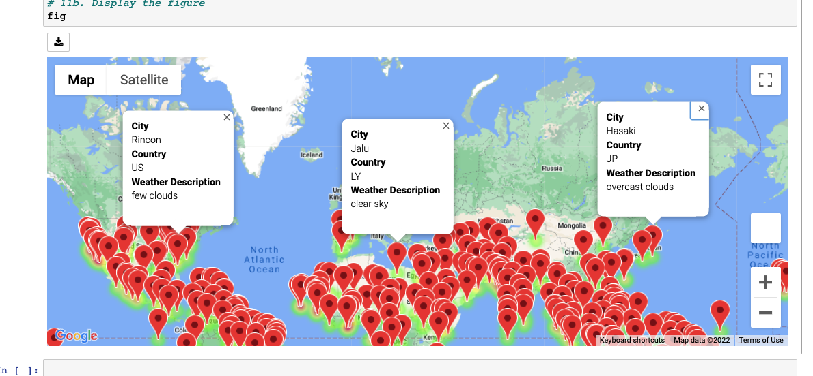
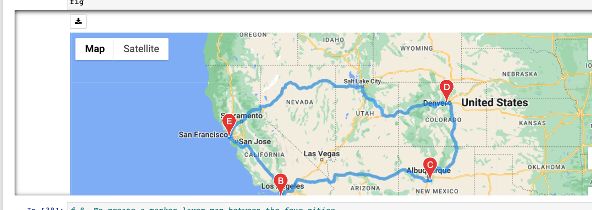
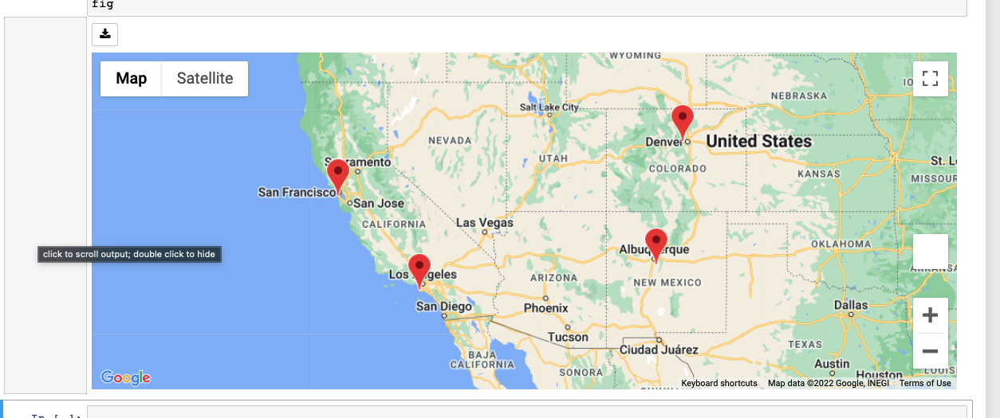

# World_Weather_Analysis
World_Weather_Analysis

## Project Overview
The purpose of this project was to create a PlanMyTrip app for our customers (in this case Beta Testers)
that would show a map with destination points and weather information based on user input. The beta testers
have submitted some app improvements that would make their experience with the app more informative and enjoyable.
They would like to see:
1. Weather description from the weather information we retrieve
2. Input for weather preferences
3. Potential destinations and hotel information based on preferences
4. Ability to choose up to four destinations to create a travel itinerary.
5. Finally, create a travel route between the destinations with marker information

## Improvments
Here the user enters in min and max temperature preferences

Then a heatmap with destination markers that have weather info is displayed

Then we can choose four destinations and map a travel itinerary

